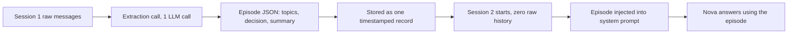
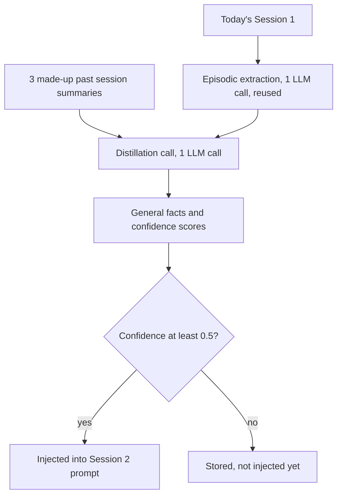
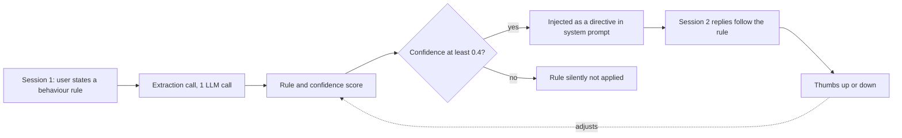
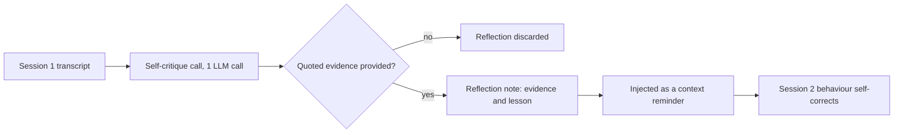
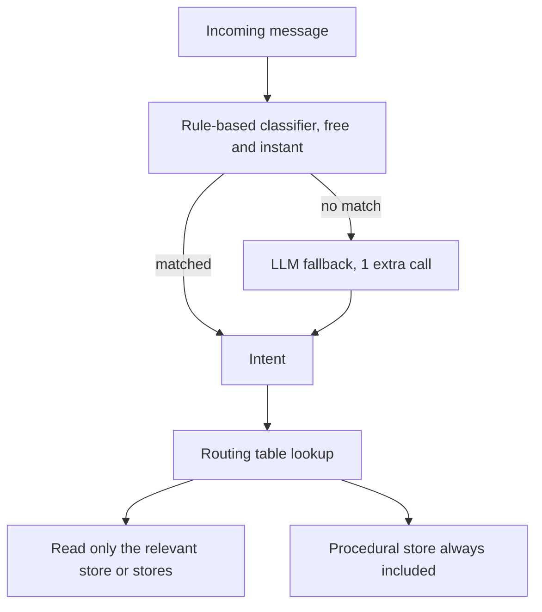

# Long-Term Memory — Architecture Diagrams

Companion reference for pages 10-14 of AI Memory Lab. Short-term memory tests survival
*within* one conversation. Long-term memory tests survival *across* separate conversations:
Session 1 happens, gets compressed into a small artifact, then a completely fresh Session 2
starts with **zero raw messages** — only that artifact. GitHub renders the Mermaid diagrams
below natively, so this is the "How It Works" view for each technique.

---

## 1. Episodic Memory

**Reading the diagram, step by step:**

1. **Session 1 raw messages** — the full back-and-forth chat, exactly as it happened.
2. **Extraction call** — one LLM call, fired the moment Session 1 closes.
3. **Episode JSON** — the whole session compressed into a few labeled fields: topics, any
   decision made, a short summary, and the mood of the conversation.
4. **Stored as one timestamped record** — this JSON is the entire memory now. The raw messages
   are not carried forward.
5. **Session 2 starts fresh** — a brand new conversation, with literally zero messages from
   Session 1 in it.
6. **Episode injected into system prompt** — the JSON record gets written into Nova's
   instructions for this new session, framed as "here's what happened last time."
7. **Nova answers using the episode** — not by remembering the chat, but by reading the diary
   entry she was just handed.

**Best:** captures a whole session as one coherent story — great for "what happened last time" questions.
**Worst:** only generated once, at session end — and a bad summary loses details for good.
**Example:** ask "what did we decide last time?" months later and it answers from one diary entry, not 50 messages.

---

## 2. Semantic Memory

**Reading the diagram, step by step:**

1. **3 made-up past session summaries** — standing in for weeks of history nobody can play out
   live in a classroom. A real deployment would have real ones, accumulated over time.
2. **Today's Session 1** goes through the exact same extraction call as Episodic Memory
   first — semantic memory is built ON TOP of episodic memory, not instead of it.
3. Both feed into one **distillation call**, which reads all 4 summaries together and asks:
   "what pattern holds true across ALL of these, not just one?"
4. The output is a small list of **general facts, each with a confidence score** — a pattern
   confirmed by multiple sessions scores higher than one seen only once.
5. Only facts **above the confidence threshold** get injected into Session 2's system prompt.
   The rest are kept on file but held back until confirmed further.

**Best:** the most compact long-term memory — a handful of general facts covers weeks of sessions.
**Worst:** needs several sessions before patterns are reliable — one weird session can skew it.
**Example:** after 4 sessions of exam stress, it learns "gets anxious under pressure" — true forever, not just today.

---

## 3. Procedural Memory

**Reading the diagram, step by step:**

1. **User states a rule** — not a fact about themselves, an instruction about how the assistant
   should behave ("keep answers short").
2. **Extraction call** finds that instruction and turns it into a clean, short rule with a
   confidence score attached.
3. The confidence score is checked against a **threshold (0.4)** — this is the step that can
   silently swallow a rule if the extractor wasn't confident about it.
4. If it clears the bar, the rule is injected into Session 2's system prompt framed as a
   **directive** ("you must"), not as background information ("here's a fact").
5. **Session 2 replies** are generated under that standing instruction.
6. The feedback loop (**thumbs up / down**) lets a rule that keeps working get reinforced, and
   a rule that backfires get weakened — this is the self-improvement loop, drawn as the dotted
   line looping back into the confidence score.

**Best:** shapes HOW the agent behaves, not just what it knows — personalises style, not just facts.
**Worst:** a bad rule that gets reinforced by mistake causes the same wrong behaviour every time.
**Example:** tell it once to keep answers short, and every future answer is short — no re-asking required.

---

## 4. Self-Reflection Memory

**Reading the diagram, step by step:**

1. **Session 1 transcript** goes back to Nova herself, not to critique the user — to critique
   her OWN replies.
2. One **self-critique call** asks: did I follow the instructions I was given during this
   session?
3. The result is checked for **quoted evidence** — a specific reply text, not a vague claim.
   This check happens in code, not just by asking the prompt nicely.
4. **No evidence → the reflection is thrown away**, even if the model claimed a mistake. This
   is the guard against hallucinated self-critique.
5. **With evidence**, the reflection becomes a structured note: what went wrong, and the lesson
   for next time.
6. It's injected into Session 2 as a **context reminder** (not a permanent operating rule like
   Procedural Memory) — a nudge for this situation, not a standing law.

**Best:** catches the agent's own mistakes and fixes them without any retraining.
**Worst:** risk of hallucinated self-critique — the evidence rule above exists specifically to guard against this.
**Example:** it notices it gave a long answer right after being asked for short ones, and self-corrects next time.

---

## 5. Memory Routing

**Reading the diagram, step by step:**

1. **Incoming message** — anything the user types.
2. First stop: a **rule-based classifier** — simple keyword matching, instant, and free. Most
   everyday messages ("what's my salary", "never recommend equity") match a rule immediately.
3. Only messages that match **nothing** fall through to an **LLM fallback classifier** — slower
   and costs one extra call, but handles the genuinely ambiguous cases.
4. Either path produces one **intent** (FACT_QUERY, HISTORY_QUERY, CONSTRAINT_UPDATE, ...).
5. The intent is looked up in a fixed **routing table** that says exactly which store(s) matter
   for that kind of message.
6. Only those store(s) get read — **except** the Procedural store, which is always included,
   because operating rules should shape every response, not just the ones that ask for advice.

**Best:** big token savings at scale — only pay for the stores that actually matter to this message.
**Worst:** a misclassified message silently queries the wrong store — and you might not notice.
**Example:** "How does a SIP work?" skips Entity and Episodic stores entirely — only Vector Store gets queried.

---

See [SHORT_TERM_MEMORY.md](SHORT_TERM_MEMORY.md) for the techniques that only need to survive
within a single conversation. See [README.md](README.md) for setup and how to run the app itself.
