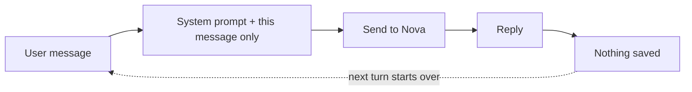
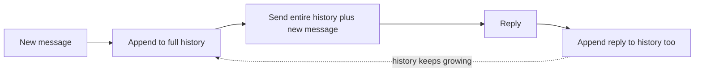
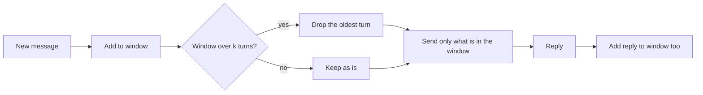
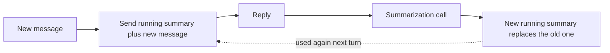
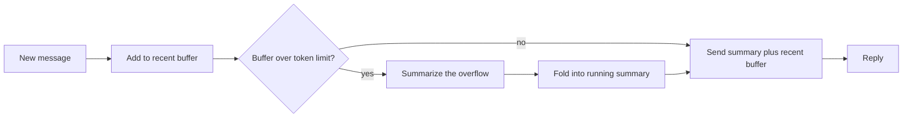
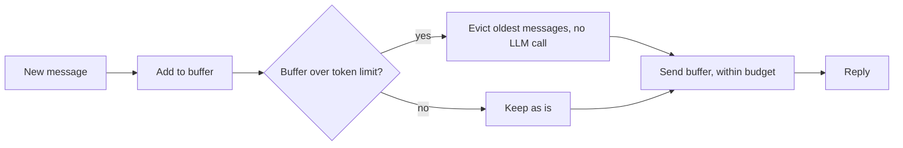
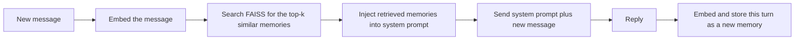
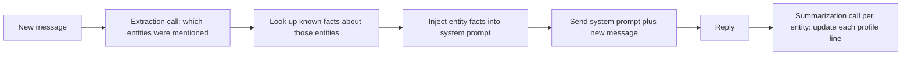

# Short-Term Memory — Architecture Diagrams

Companion reference for pages 1-8 of AI Memory Lab. Each technique answers the same
question — **does a fact survive more turns in the SAME conversation?** — with a different
trade-off between recall, cost, and complexity. GitHub renders the Mermaid diagrams below
natively, so this is the "How It Works" view for each technique.

---

## 1. No Memory (the baseline)

**Best:** it's free and instant — there's no memory to store, manage, or pay for.
**Worst:** it forgets everything the moment you say it, even one message later.
**Example:** tell it your name, then ask again on the very next message — it has no idea.

---

## 2. Buffer Memory

**Best:** never forgets anything — perfect recall, every single time.
**Worst:** gets slower and more expensive the longer the conversation runs.
**Example:** a 500-message chat means resending all 500 messages, on every single turn.

---

## 3. Sliding Window Memory

**Best:** cheap and fast — the cost never grows, no matter how long the chat runs.
**Worst:** anything older than the window is gone completely, even if it still matters.
**Example:** mention your allergy on turn 1, and by turn 10 it's already forgotten.

---

## 4. Summary Memory

**Best:** can hold the gist of a very long conversation in just a few sentences.
**Worst:** costs 2 API calls every single turn, and details can blur after enough rewrites.
**Example:** after 20 rewrites of the recap, a small detail like a middle name quietly disappears.

---

## 5. Summary Buffer Memory

**Best:** balances both worlds — sharp on recent details, still keeps the gist of the old stuff.
**Worst:** more moving parts than either technique alone, so it's harder to predict and tune.
**Example:** it nails what you said 2 turns ago, and roughly recalls what you said 20 turns ago.

---

## 6. Token Buffer Memory

**Best:** totally predictable — you always know the exact cost ceiling per turn.
**Worst:** still forgets older messages once the token budget fills up, just like a window.
**Example:** set a 150-token limit, and the oldest messages get dropped the moment you cross it.

---

## 7. Vector Store Memory

**Best:** finds the right memory no matter how long ago it was said — no distance limit at all.
**Worst:** only retrieves what SOUNDS relevant, so it can miss context that matters but is worded differently.
**Example:** ask "what's my pet's name" 200 messages later and it still finds it instantly.

---

## 8. Entity Memory

**Best:** keeps a tiny, tidy profile of facts that never grows huge, no matter how long you chat.
**Worst:** only remembers things shaped like "facts about a name" — it's bad at free-flowing stories.
**Example:** it knows "Whiskers = Maya's cat" forever, but can't tell you what you two joked about.

---

See [LONG_TERM_MEMORY.md](LONG_TERM_MEMORY.md) for the techniques that survive *across*
separate conversations, not just within one. See [README.md](README.md) for setup and how
to run the app itself.
