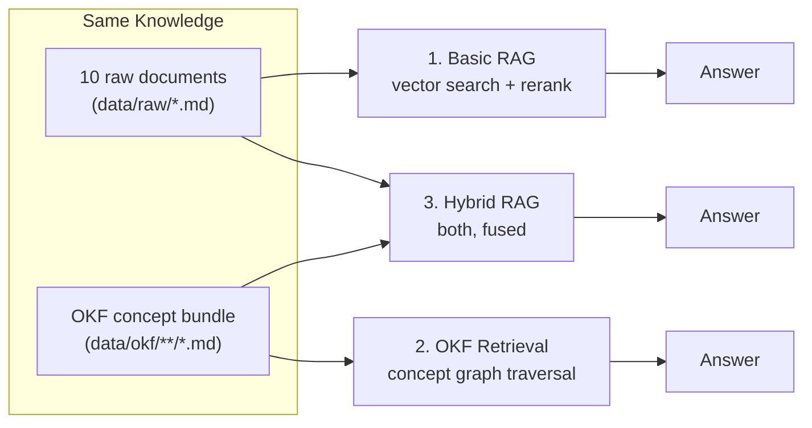

# 01. Project Overview

## 1.1 What is this?

A runnable teaching demo, built for a webinar, that answers one question:

> When does organizing knowledge as a **graph of linked concepts** beat plain **vector search over
> documents** - and when doesn't it?

Instead of just explaining this on slides, we built all three systems for real, pointed them at
the same small knowledge base, asked them the same 7 questions, and scored the answers with an
independent LLM judge. Nothing here is simulated or hand-picked after the fact - every number in
[10_results_and_findings.md](./10_results_and_findings.md) came out of an actual run against live
Groq/Jina APIs.

## 1.2 The three systems



1. **Basic RAG** - chunk the raw documents, embed them, retrieve the top matches by similarity,
   rerank, answer. The standard approach almost every RAG tutorial teaches.
2. **OKF Retrieval** - the same knowledge, but curated by hand into a small graph of linked
   concept files (Open Knowledge Format). Answering means: find the concept the question is
   about, walk its edges, answer from what you found.
3. **Hybrid RAG** - runs both retrieval paths in parallel and hands the LLM both kinds of
   evidence at once.

All three are implemented as [LangGraph](https://langchain-ai.github.io/langgraph/) pipelines and
each has its own Streamlit app so you can run and compare them live. See
[07_project_architecture.md](./07_project_architecture.md) for the full technical picture.

## 1.3 Why does this matter?

Vector search is excellent at "find text that sounds like the question." It is not naturally good
at questions that require **connecting** facts that are individually true but live in different
documents and don't sound alike ("what's the full path from A to E, given A->B, B->C, C->D, D->E
are each stated in a different file?"). [05_problems_with_traditional_rag.md](./05_problems_with_traditional_rag.md)
shows this happening for real, not hypothetically.

## 1.4 Repo map

```text
okf/
├── data/
│   ├── raw/                 10 source documents (the "messy" corpus, see doc 06)
│   ├── okf/                 the same knowledge, curated as an OKF bundle (see doc 04)
│   └── processed/           FAISS index + generated graph HTML (built, not committed)
│
├── src/
│   ├── config.py             env vars, paths, model names
│   ├── jina_embeddings.py    direct Jina embeddings API client
│   ├── jina_reranker.py      direct Jina reranker API client
│   ├── faiss_store.py        minimal direct FAISS wrapper
│   ├── llm.py                Groq chat model factories (generation + judge)
│   ├── ingestion.py          load + chunk the raw documents
│   ├── okf_loader.py         parse OKF markdown+YAML into concepts + typed edges
│   ├── okf_graph.py          the concept graph (networkx) + traversal + visualization
│   ├── okf_search.py         keyword scoring to match a question to a concept
│   ├── okf_retrieval.py      shared match+traverse logic (used by OKF and Hybrid)
│   ├── evaluation.py         openevals metric comparison (local run)
│   ├── langsmith_eval.py     same comparison, as 3 LangSmith Experiments on 1 Dataset
│   └── graphs/
│       ├── basic_rag_graph.py    LangGraph: retrieve -> generate
│       ├── okf_rag_graph.py      LangGraph: match_concept -> traverse -> generate
│       └── hybrid_rag_graph.py   LangGraph: [vector_retrieve ‖ okf_retrieve] -> fuse -> generate
│
├── tests/evaluation_questions.json   the fixed 7-question eval set
├── docs/                              you are here
│
├── build_index.py            one-off: chunk + embed + write the FAISS index
├── run_evaluation.py         run the local openevals comparison
├── run_langsmith_eval.py     run the LangSmith Dataset+Experiments version
│
├── 1_basic_rag_app.py        Streamlit: Basic RAG
├── 2_okf_rag_app.py          Streamlit: OKF Retrieval
├── 3_hybrid_rag_app.py       Streamlit: Hybrid RAG
│
├── requirements.txt
└── .env.example
```

## 1.5 How to run it

```bash
# 1. Set up keys (Groq, Jina, optionally a separate Groq key for the judge, optionally LangSmith)
cp .env.example .env

# 2. Install
uv pip install -r requirements.txt

# 3. Build the vector index (needs JINA_API_KEY)
python build_index.py

# 4. Try each system live
streamlit run 1_basic_rag_app.py
streamlit run 2_okf_rag_app.py
streamlit run 3_hybrid_rag_app.py

# 5. Run the metric comparison
python run_evaluation.py          # local run -> tests/eval_results.json
python run_langsmith_eval.py      # same thing, as 3 LangSmith Experiments on 1 Dataset
```

## 1.6 Stack, in one line each

| Piece | Choice | Why |
|---|---|---|
| Knowledge format | Google Open Knowledge Format (OKF) v0.2 | Markdown + YAML, no database required - see doc 04 |
| Embeddings | Jina `jina-embeddings-v3` | Task-specific adapters (`retrieval.query` vs `retrieval.passage`) |
| Reranker | Jina `jina-reranker-v3.5` | Reorders vector-search candidates before generation |
| Vector store | FAISS (direct, not via `langchain_community`) | `langchain_community` was archived in June 2026 |
| Orchestration | LangGraph `StateGraph` | Explicit, inspectable pipeline steps - not a hidden agent loop |
| LLM (generation) | Groq `openai/gpt-oss-120b` | Fast, current, non-deprecated on Groq |
| LLM (eval judge) | Groq `openai/gpt-oss-20b` | More reliable at forced structured output than the 120b model - see doc 09 |
| Evaluation | `openevals` (LLM-as-judge) + LangSmith Datasets/Experiments | Metric-based, side-by-side comparison |
