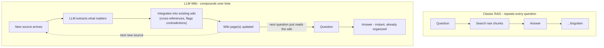
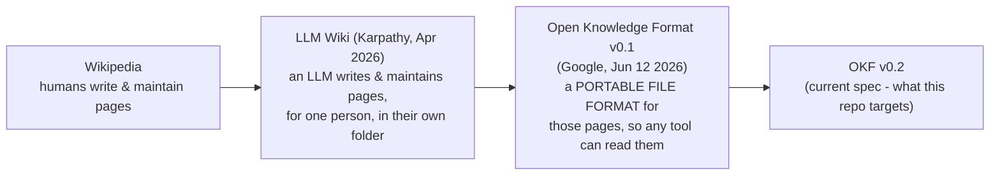

# 02. History: From "LLM Wiki" to OKF

Before touching any code, it's worth understanding **where this whole idea came from**. It didn't
start as a corporate spec. It started as a tweet.

## 2.1 The problem, in plain words

Say you're researching a topic. You read paper after paper, article after article. Every time you
want to ask "wait, how does X relate to Y?", the usual AI-assistant answer is: re-read a pile of
raw text, find the relevant bits, and answer - **from scratch, every single time.** Nothing you
learned in the last conversation carries over to the next one. The AI never actually *builds*
understanding; it re-derives it, over and over, at your expense in time and tokens.

That's exactly how a standard RAG chatbot works: chunk documents, embed them, search, answer,
forget. Ask the same underlying question tomorrow and it re-searches from zero again.

## 2.2 Andrej Karpathy's "LLM Wiki" idea

In early April 2026, [Andrej Karpathy](https://en.wikipedia.org/wiki/Andrej_Karpathy) (former
Tesla AI director, OpenAI founding member) posted a simple tweet:

> "Something I'm finding very useful recently: using LLMs to build personal knowledge bases for
> various topics of research interest."

He described a habit: drop raw source material (papers, notes, articles) into a folder, and have
an LLM read them and **maintain a wiki** - a set of linked Markdown pages, like a personal
Wikipedia - that gets updated every time new material comes in. Not "answer my question by
re-reading everything," but "keep a living, organized notebook that already has the answer
written down, and update the notebook when something new arrives."

The tweet went viral (tens of millions of views). The next day he followed up with an **"idea
file"** - a public GitHub gist laying out the whole pattern: architecture, philosophy, tooling -
explicitly so that *anyone's own coding agent* could build them their own version of it. His own
summary of the idea, in one line:

> "Obsidian is the IDE. The LLM is the programmer. The wiki is the codebase."

## 2.3 Why this was such a good idea

Compare the two loops:

Three things make this genuinely different from "just do RAG better":

1. **Compile once, reuse forever.** The expensive work (reading, understanding, connecting) only
   happens once per source, not once per question.
2. **Knowledge compounds.** Page 50 can link to page 3. A new document about "Deep Learning" can
   automatically get cross-referenced against the existing "Machine Learning" page, because the
   LLM sees both while updating the wiki - something a pure per-query RAG system, which only ever
   sees isolated chunks, structurally cannot do.
3. **It's inspectable.** The "wiki" is just Markdown files. You can open them, read them, edit
   them, put them in git, and see exactly what the system believes - no vector database or hidden
   embedding space to decode.

## 2.4 From a personal trick to an open standard

Karpathy's idea file was a *pattern* - a way of working, not a spec anyone could build interoperable
tools against. Two months later, Google formalized it:

Google's announcement described OKF explicitly as **formalizing the LLM-Wiki pattern** into
something vendor-neutral: still Markdown files with YAML frontmatter, still human-readable, but
now with agreed conventions so that *different tools* (not just one person's personal setup) can
read, write, and exchange the same knowledge bundle. That's the key shift: Karpathy's idea was
"how I personally organize my research"; OKF is "how any two systems could agree on the shape of
that organization so bundles are portable between them."

- Google Cloud announcement: https://cloud.google.com/blog/products/data-analytics/how-the-open-knowledge-format-can-improve-data-sharing/
- OKF specification: https://github.com/GoogleCloudPlatform/knowledge-catalog/blob/main/okf/SPEC.md

## 2.5 What this repo actually is, in that lineage

This project is a small, concrete instance of exactly that lineage: `data/okf/` is an OKF v0.2
bundle - a tiny, hand-curated "wiki" of 8 concept pages about an AI curriculum, linked to each
other, each with its source traced back to a raw document. [04_what_is_okf.md](./04_what_is_okf.md)
dissects it in detail. The rest of the project exists to answer the natural follow-up question:
*does having that wiki actually help retrieval, compared to plain vector search?* (Short answer,
demonstrated with real numbers in [10_results_and_findings.md](./10_results_and_findings.md): yes,
specifically on questions that need you to connect facts across documents.)
