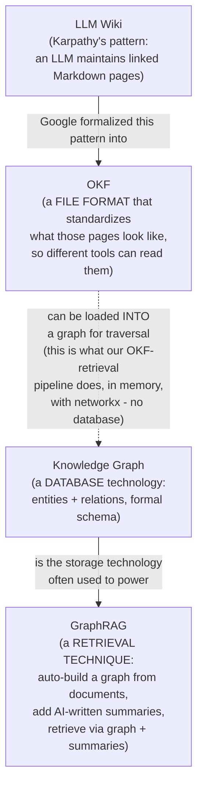

# 03. LLM Wiki vs Knowledge Graph vs GraphRAG vs OKF

These four terms get used almost interchangeably in conversation, but they're four different
*kinds* of things - a habit, a database technology, a retrieval technique, and a file format.
Here they are, told apart, using one running fact from our own data:

> **"Deep Learning requires Machine Learning."**

## 3.1 The one-paragraph distinction

| | What kind of thing is it? | Who/what maintains it? | Where does it live? |
|---|---|---|---|
| **LLM Wiki** | A *habit / pattern* | An LLM, for one person, informally | Wherever you put your Markdown files (e.g. Obsidian) |
| **Knowledge Graph** | A *database technology* | A formal schema + curators or an extraction pipeline | A graph database (Neo4j, etc.) |
| **GraphRAG** | A *retrieval technique* | An automated pipeline that builds a graph from your documents | A graph store + a summarization index, purpose-built for retrieval |
| **OKF** | A *file format* | Anyone/anything - humans or LLMs | Plain Markdown + YAML files, in any folder or git repo |

## 3.2 The same fact, represented four ways

**As an LLM Wiki page** (informal, human-readable, whatever structure you like):

```markdown
## Deep Learning
Builds on Machine Learning. Uses neural nets, backprop, gradient descent.
See also: Computer Vision, NLP (both build on this).
```

**As a Knowledge Graph triple** (formal, needs a defined schema/ontology first):

```text
(:Concept {name: "Deep Learning"})-[:REQUIRES]->(:Concept {name: "Machine Learning"})
```
Stored in a graph database like Neo4j; queried with a graph query language like Cypher.

**As a GraphRAG artifact** (a graph *automatically extracted* from documents, plus AI-written
community summaries, purpose-built to answer "what connects broad themes" style questions):

```text
Entity: Deep Learning        [extracted from deep_learning.md by an LLM]
Entity: Machine Learning     [extracted from deep_learning.md by an LLM]
Relationship: Deep Learning --REQUIRES--> Machine Learning
Community summary: "The AI curriculum concepts form a prerequisite chain from
  foundational programming through to specialized applications..."
```

**As OKF** (a Markdown file with YAML frontmatter - this is a real file in this repo,
[`data/okf/concepts/deep-learning.md`](../data/okf/concepts/deep-learning.md)):

```markdown
---
type: Concept
title: Deep Learning
description: Neural-network-based machine learning methods.
tags: [AI, ML, neural-networks]
source: data/raw/deep_learning.md
---

# Deep Learning

## Prerequisites

- [Machine Learning](./machine-learning.md)
```

## 3.3 How they actually relate to each other



The important thing this diagram tries to make obvious: **OKF and Knowledge Graphs are not
competitors** - they're different layers. OKF is a *format for files on disk*. A Knowledge Graph
is a *way of storing and querying* entities/relations, usually in a dedicated database. You can
absolutely load an OKF bundle into a real graph database if you need graph-database features
(the OKF spec explicitly allows this, and doesn't prescribe *not* doing it). This project does
something lighter: it loads the OKF bundle into an in-memory `networkx.DiGraph`
([`src/okf_graph.py`](../src/okf_graph.py)) - a graph data structure, not a graph *database* -
because our bundle is small (8 concepts) and doesn't need persistence, indexing, or a query
language. For a bundle with thousands of concepts, loading OKF into a real graph database would
be the natural next step, and OKF's Markdown files would still be the source of truth.

**GraphRAG** is its own thing again: it's a specific *technique* (most associated with Microsoft's
research) for building a graph *automatically* from unstructured documents (no human curation)
and pairing it with LLM-generated summaries of clusters of related entities, specifically to
answer broad "what are the themes across this whole corpus" questions well. Our **Hybrid RAG**
pipeline is philosophically similar in spirit - combine graph-shaped knowledge with raw-text
evidence - but much simpler: our graph is hand-curated (not auto-extracted), small, and has no
community-summarization step. Think of Hybrid RAG here as "GraphRAG's little cousin, built on top
of OKF instead of an auto-extracted graph."

## 3.4 Quick gut-check table

| Question | LLM Wiki | Knowledge Graph | GraphRAG | OKF |
|---|---|---|---|---|
| Is it a file format? | Loosely (Markdown, unstandardized) | No (it's a database) | No (it's a pipeline + index) | **Yes, precisely** |
| Does it require a database? | No | **Yes** | Usually yes | **No** |
| Who builds the structure? | An LLM, informally | Humans + a schema, or an extraction pipeline | An automated LLM pipeline | Anyone - human or LLM, following the format |
| Is it vendor-neutral? | N/A (personal habit) | Depends on the DB vendor | Depends on implementation | **Yes, by design** |
| What does this repo use? | The *inspiration* | Not used directly | Not used directly (Hybrid RAG is inspired by it) | **The actual format of `data/okf/`** |
