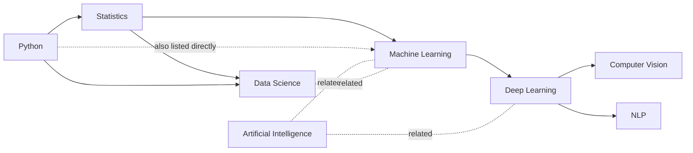

# 04. What is OKF?

## 4.1 The one-sentence version

> **OKF is a folder of Markdown files, each with a small YAML header on top, that link to each
> other - a standardized way to write down "here's a thing, here's what it is, here's what it
> connects to."**

That's it. No server, no database, no special software required to read one. Open any file in
`data/okf/concepts/` in a plain text editor and you can read the whole thing.

## 4.2 Dissecting a real concept file

Here is the actual, complete content of
[`data/okf/concepts/deep-learning.md`](../data/okf/concepts/deep-learning.md) in this repo:

```markdown
---
type: Concept
title: Deep Learning
description: Neural-network-based machine learning methods.
tags: [AI, ML, neural-networks]
source: data/raw/deep_learning.md
---

# Deep Learning

Deep Learning covers neural network architectures, backpropagation, and optimization, extending
the foundations laid by Machine Learning.

## Prerequisites

- [Machine Learning](./machine-learning.md)

## Related Concepts

- [Artificial Intelligence](./artificial-intelligence.md)
```

Breaking that down piece by piece:

| Part | What it is | Why it's there |
|---|---|---|
| `---` ... `---` block | YAML frontmatter | Structured metadata a program can parse without reading prose |
| `type: Concept` | The kind of thing this file describes | Lets a loader tell concepts apart from courses, indexes, etc. |
| `title` / `description` / `tags` | Searchable metadata | Used by our keyword search ([`src/okf_search.py`](../src/okf_search.py)) |
| `source: data/raw/deep_learning.md` | Provenance | Points back to the original raw document this concept was curated from |
| The Markdown body | Human-readable explanation | Read by a person, or fed to an LLM as context |
| `## Prerequisites` heading + link | A **typed relationship** | Our loader treats links under this exact heading as "requires" edges |
| `## Related Concepts` heading + link | A different **typed relationship** | Treated as a looser "related" edge (not a strict prerequisite) |

That last point is the clever bit and it's worth dwelling on: **OKF itself doesn't define edge
types** - it's just Markdown links. *We* decided, for this project, that a link's meaning depends
on which heading it sits under, and wrote a small parser
([`src/okf_loader.py`](../src/okf_loader.py)) to read it that way. That's a deliberate design
choice we made on top of the format, not something OKF forces on you - and that's exactly the
point of OKF being a format and not a rigid schema: you get to decide what your links mean.

## 4.3 What OKF is *not*

- **Not a database.** There's no query engine bundled with it. If you want fast lookup over a
  huge bundle, you build (or load into) one yourself - OKF just describes the files.
- **Not a graph database.** Even though the links form a graph shape, OKF is the *file format*
  the graph is written in, not the storage/query engine (see doc 03 for the fuller distinction).
- **Not tied to one vendor's tools.** Google published the spec and a reference implementation,
  but nothing about the format requires Google Cloud, BigQuery, or Gemini. This whole project
  never touches GCP.
- **Not automatically a knowledge graph.** A bundle only becomes graph-shaped if you actually put
  links between files. A folder of unlinked Markdown files is a valid but uninteresting OKF
  bundle - all nodes, no edges.

## 4.4 Our bundle, as a whole

```text
data/okf/
├── index.md                     entry point, links to everything
├── concepts/
│   ├── python.md                no prerequisites
│   ├── statistics.md            requires: python
│   ├── machine-learning.md      requires: statistics, python | related: AI, data-science
│   ├── deep-learning.md         requires: machine-learning   | related: AI
│   ├── computer-vision.md       requires: deep-learning
│   ├── nlp.md                   requires: deep-learning
│   ├── artificial-intelligence.md   related: machine-learning, deep-learning
│   └── data-science.md          requires: statistics, python | related: machine-learning
└── courses/
    ├── machine-learning.md      bundles python + statistics + machine-learning together
    ├── deep-learning.md         bundles the ML track + deep-learning
    └── computer-vision.md       bundles the DL track + computer-vision
```

As a picture (arrows point from "this concept" to "what it requires"):



Solid arrows are `requires` edges (walked by prerequisite/path questions); dotted lines are
`related` edges (extra context, not a strict order). Notice Machine Learning has **two** direct
prerequisite edges (Statistics *and* Python) - this small detail turned out to matter a lot; see
the "longest path" story in [08_code_walkthrough.md](./08_code_walkthrough.md#82-the-two-bugs-we-actually-hit).

## 4.5 Where the graph comes from, in code

1. [`src/okf_loader.py`](../src/okf_loader.py) walks every `.md` file, splits the YAML frontmatter
   from the body, and scans the body line by line, remembering which `##` heading it's currently
   under. Every Markdown link it finds gets tagged with an edge type based on that heading
   (`Prerequisites` -> `requires`, `Related Concepts` -> `related`, anything else -> `related`).
2. [`src/okf_graph.py`](../src/okf_graph.py) loads those concepts and edges into a
   `networkx.DiGraph` and exposes the operations retrieval actually needs: `prerequisite_chain`
   (BFS outward from a concept, "what comes before this"), `study_path` (the full ordered chain
   between two named concepts), `related` (the loose connections), and `render_html` (a
   [PyVis](https://pyvis.readthedocs.io/) interactive graph you can view inside the OKF Streamlit
   app).

No database, no server - just parsing text files into an in-memory graph, in well under a second.
