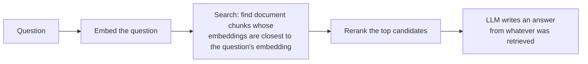

# 05. Problems with Traditional RAG

This isn't a theoretical complaint about RAG - the failure below is a real answer our own Basic
RAG pipeline produced, captured verbatim during testing. Traditional (vector-search) RAG is
genuinely excellent at a lot of things. This doc is about the specific, well-understood class of
question where it struggles, and why.

## 5.1 How Basic RAG works (and where the gap opens up)



Every step here depends on one assumption: **the chunks that contain the answer must be embedding-
similar to the question.** That's usually true - if you ask "what are the prerequisites for
Machine Learning?", the chunk that answers it literally contains the words "prerequisites" and
"Machine Learning." Vector search finds it easily.

It breaks down when the answer isn't *in any single chunk* - it has to be **assembled** from facts
that live in different documents, each of which only states its own small piece, worded nothing
like the question.

## 5.2 A real failure, captured

We asked all three of our systems the same question:

> **"What is the path from Python to Computer Vision?"**

The true answer requires chaining five separate facts, each stated in a *different* document:

```text
python_prerequisites.md:      (no prerequisite - it's the starting point)
statistics_prerequisites.md:  Statistics requires Python
machine_learning.md:          Machine Learning requires Statistics and Python
deep_learning.md:              Deep Learning requires Machine Learning
computer_vision.md:            Computer Vision requires Deep Learning
```

Here's what Basic RAG actually retrieved (top 4, after reranking, real scores from our run):

| Retrieved chunk | Vector score | Rerank score |
|---|---|---|
| `computer_vision.md` | 0.536 | 0.314 |
| `computer_vision.md` (different chunk) | 0.513 | 0.084 |
| `nlp.md` | 0.488 | -0.005 |
| `python_prerequisites.md` | 0.449 | -0.035 |

Notice what's **missing**: `statistics_prerequisites.md` and `machine_learning.md` - the two
middle links in the chain - never made it into the candidate pool at all. Why? Because the
sentence "Statistics for Data-Driven Fields requires Python Programming Fundamentals" doesn't
share much *embedding similarity* with the query "what is the path from Python to Computer
Vision?" - it just doesn't sound like the question, even though it's logically essential to
answering it. Meanwhile `computer_vision.md` sounds very related (it literally contains the words
"Computer Vision"), so it gets retrieved twice.

The LLM, given only those four chunks, wrote a fluent, confident, **wrong** answer:

> "1. Start with the Python prerequisite course... 2. Proceed to the Deep Learning course (AI401)
> ... 3. Enroll in the Computer Vision course (AI411)..."

It skipped Statistics and Machine Learning entirely - not because the model reasoned badly, but
because **it was never shown those two facts.** Our LLM-judge evaluation scored this answer
`correctness = 0.15` (see [10_results_and_findings.md](./10_results_and_findings.md)) even though
the same judge scored it `helpfulness = 0.95` - it *read* as a great answer. That gap between
"sounds right" and "is right" is the whole problem in one number.

## 5.3 Why reranking doesn't fix this

A reranker (we use Jina's `jina-reranker-v3.5`) takes the *candidates already retrieved* and puts
the most relevant ones first. That's genuinely useful - it improved our top-4 selection quality on
several questions. But it **cannot retrieve a chunk that was never in the candidate pool to begin
with.** If `statistics_prerequisites.md` never made it into the top 10 candidates from vector
search, no amount of reranking those 10 will make it appear. Reranking fixes *ordering* problems.
It does not fix *coverage* problems. This project's Basic RAG pipeline (see
[`src/graphs/basic_rag_graph.py`](../src/graphs/basic_rag_graph.py)) retrieves 10 candidates,
reranks down to 4 - and the missing documents are absent from all 10, not just the top 4.

## 5.4 The general pattern

This isn't specific to our toy example - it's a known, well-documented limitation of pure
similarity search:

| Question type | Does vector search handle it well? | Why |
|---|---|---|
| Direct lookup ("What are X's prerequisites?") | **Yes** | The answer is stated in one place, worded like the question |
| Multi-hop ("Path from A to E, via B, C, D?") | **Often no** | Middle-of-chain facts don't sound like the question |
| Relationship ("What connects A and B?") | **Sometimes** | Depends on whether the connecting concept is retrieved at all |
| Provenance ("Where did this fact come from?") | **Weak** | Chunk retrieval doesn't track structured lineage |
| Navigation ("What should I learn next?") | **Weak** | There's no explicit "next" relationship in raw prose |

## 5.5 What actually fixes it

Not "a bigger model" and not "a better reranker" - **a structure that doesn't depend on textual
similarity at all.** OKF retrieval doesn't search for text that sounds like the question; once it
matches the question to a *starting concept*, it just walks explicit edges: Python -> Statistics
-> Machine Learning -> Deep Learning -> Computer Vision, regardless of how differently those five
sentences are worded. See [06_the_dataset.md](./06_the_dataset.md) for exactly how this chain was
built into the data, and [10_results_and_findings.md](./10_results_and_findings.md) for the
measured result: OKF and Hybrid both scored `correctness = 1.00` on this exact question.

This is also precisely why the [class materials](../01_OKF_RAG_Class_Concept_and_Plan.md) this
project is based on are careful to say: **don't claim RAG is bad.** It isn't - it was the strongest
system on direct-lookup and detailed-explanation questions in our own results. The honest claim is
narrower and, we think, more useful: *vector search and graph traversal are good at different
things, and a real system benefits from having both* - which is exactly what Hybrid RAG is for.
