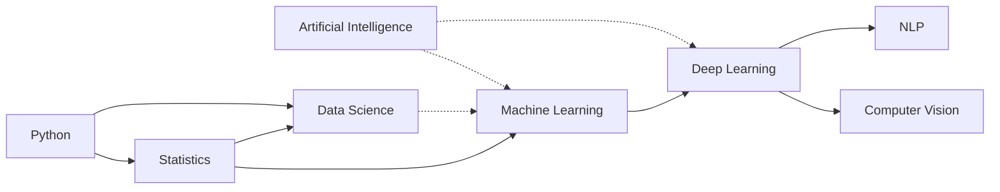

# 06. The Dataset

## 6.1 The domain

A small, fictional "University AI/Cybersecurity Curriculum" - 8 subjects, forming a prerequisite
chain, plus 2 unrelated administrative documents thrown in as noise. Small enough to read in five
minutes; structured enough to genuinely test multi-hop reasoning.

(solid = prerequisite, dotted = related-but-not-required)

## 6.2 Why it's "messy" on purpose - and what that actually means

Important distinction: **messy does not mean broken, contradictory, or artificially sabotaged.**
Every fact in every document is true and consistent with every other document. "Messy" here means
something much more mundane and realistic: **each document only describes itself.** Nobody sat
down and wrote out the full five-step chain from Python to Computer Vision anywhere - because
nobody does that in real course catalogs either. The `deep_learning.md` course page says "builds
on Machine Learning." It does not also re-explain that Machine Learning builds on Statistics, which
builds on Python - why would it? That's not deep_learning.md's job. This is exactly how real
documentation is scattered in practice, and it's precisely the condition under which "search for
text similar to the question" starts to miss things (see doc 05).

We followed the scattering pattern specified in the original class materials
([`02_OKF_RAG_Demo_Architecture_and_Lab.md`](../02_OKF_RAG_Demo_Architecture_and_Lab.md), section 3)
deliberately:

> `machine_learning.md`: "Machine Learning builds on Statistics and Python."
> `deep_learning.md`: "Deep Learning builds on Machine Learning."
> `computer_vision.md`: "Computer Vision uses Deep Learning."

Each sentence is local and true. The *chain* only exists if you connect all of them.

## 6.3 The 10 raw documents

| File | What it actually says | Prerequisite fact it carries |
|---|---|---|
| `python_prerequisites.md` | Intro programming course, no prior knowledge needed | *(none - the starting point)* |
| `statistics_prerequisites.md` | Stats course, labs use Python | Statistics **requires** Python |
| `machine_learning.md` | ML course: regression, clustering, evaluation | ML **requires** Statistics *and* Python |
| `deep_learning.md` | Neural nets, backprop, optimization | Deep Learning **requires** Machine Learning |
| `computer_vision.md` | CNNs, image classification, detection | Computer Vision **requires** Deep Learning |
| `nlp.md` | Text processing, embeddings, transformers | NLP **requires** Deep Learning |
| `artificial_intelligence.md` | Survey course: search, planning, subfields | *(no requirement - ML/DL are described as subfields of it)* |
| `data_science.md` | End-to-end analytics workflow | Data Science **requires** Statistics and Python; **related to** ML |
| `curriculum_rules.md` | Grading, attendance, resits | *(noise - no subject-matter content)* |
| `project_guidelines.md` | Capstone submission format, deadlines | *(noise - no subject-matter content)* |

## 6.4 Why two "noise" documents are in there

`curriculum_rules.md` and `project_guidelines.md` are real, on-topic *administrative* documents -
but they carry zero information about how subjects relate to each other. They exist to test two
things at once:

1. **Basic RAG should still answer questions about them correctly** (e.g. "what's the minimum
   attendance to sit finals?") - because they *are* in the raw corpus, and a good retriever should
   find them just fine. Our results confirm this: correctness 1.00 across all three pipelines that
   have access to the raw corpus.
2. **OKF-only retrieval should honestly say "not covered"** rather than fabricate an answer -
   because these two documents were deliberately **not** curated into the OKF bundle at all. This
   checks that OKF retrieval respects its own boundary instead of hallucinating graph edges that
   don't exist. Our results confirm this too: the OKF pipeline correctly declined to answer.

## 6.5 Raw documents -> OKF concepts

Not every raw document became an OKF concept - this is the actual curation step a human (or an
LLM, per the "LLM Wiki" pattern from doc 02) would perform:

| Raw document | Curated into OKF concept? | OKF concept file |
|---|---|---|
| `python_prerequisites.md` | Yes | `concepts/python.md` |
| `statistics_prerequisites.md` | Yes | `concepts/statistics.md` |
| `machine_learning.md` | Yes | `concepts/machine-learning.md` |
| `deep_learning.md` | Yes | `concepts/deep-learning.md` |
| `computer_vision.md` | Yes | `concepts/computer-vision.md` |
| `nlp.md` | Yes | `concepts/nlp.md` |
| `artificial_intelligence.md` | Yes | `concepts/artificial-intelligence.md` |
| `data_science.md` | Yes | `concepts/data-science.md` |
| `curriculum_rules.md` | **No** | *(not part of the knowledge graph, by design)* |
| `project_guidelines.md` | **No** | *(not part of the knowledge graph, by design)* |

Each OKF concept file keeps a `source:` field pointing back to its raw document (see
[04_what_is_okf.md](./04_what_is_okf.md#42-dissecting-a-real-concept-file)) - so even after
curation, you can always trace a concept back to where it came from.

## 6.6 The fixed evaluation questions

All three systems are tested against the exact same 7 questions
([`tests/evaluation_questions.json`](../tests/evaluation_questions.json)), chosen to cover
different retrieval patterns:

| ID | Question | Type | What it tests |
|---|---|---|---|
| q1 | What are the prerequisites for Machine Learning? | direct | Single-document lookup |
| q2 | What is the path from Python to Computer Vision? | multi-hop | Chaining 5 documents |
| q3 | What concepts connect Machine Learning and Computer Vision? | relationship | Finding the connecting node (Deep Learning) |
| q4 | What should a student study before Computer Vision? | multi-hop | Same chain, prerequisite phrasing |
| q5 | Why is Deep Learning relevant to Computer Vision? | synthesis | Detailed explanation (favors raw text) |
| q6 | How is Data Science related to Machine Learning? | relationship | A *non*-prerequisite ("related") edge |
| q7 | What is the minimum attendance required to sit final examinations? | direct-noise | Tests the OKF-bundle boundary (6.4 above) |
