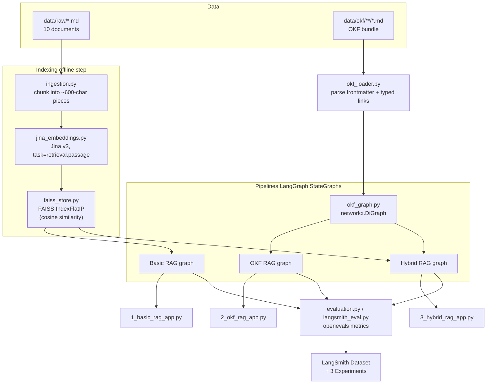
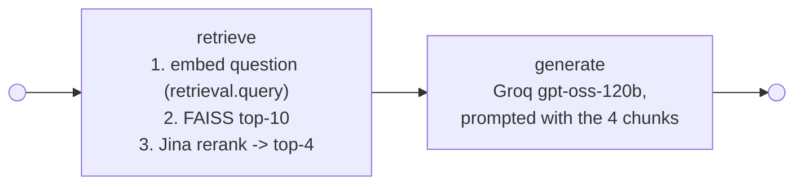
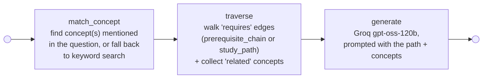
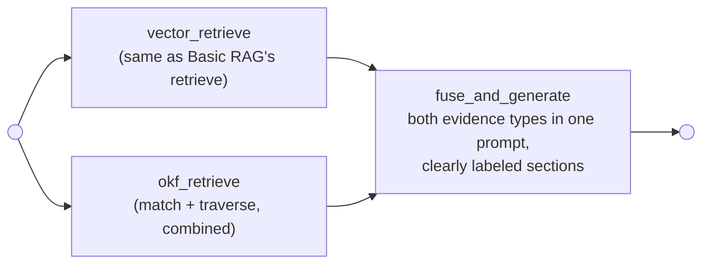

# 07. Project Architecture

## 7.1 The big picture



## 7.2 Pipeline 1: Basic RAG



State (`BasicRagState`): `question`, `chunks`, `answer`. Two nodes, one path. See
[`src/graphs/basic_rag_graph.py`](../src/graphs/basic_rag_graph.py).

## 7.3 Pipeline 2: OKF Retrieval



State (`OkfRagState`): `question`, `matched_concepts`, `path`, `concepts_context`, `answer`. Three
nodes, in sequence - deliberately kept as three separate, inspectable steps rather than one
"do everything" function, so the pipeline diagram matches what a student sees on screen in the
Streamlit app: which concept matched, then what path was walked. See
[`src/graphs/okf_rag_graph.py`](../src/graphs/okf_rag_graph.py) and the shared logic in
[`src/okf_retrieval.py`](../src/okf_retrieval.py).

## 7.4 Pipeline 3: Hybrid RAG



`vector_retrieve` and `okf_retrieve` both start from `START` - LangGraph runs them **in parallel**
in the same superstep, then both feed into `fuse_and_generate`. This is a genuine fan-out/fan-in,
not two sequential calls dressed up - the two retrieval systems don't know about each other and
write to different state keys (`chunks` vs `matched_concepts`/`path`/`concepts_context`), so there's
no conflict to resolve. See [`src/graphs/hybrid_rag_graph.py`](../src/graphs/hybrid_rag_graph.py).

The fused prompt has explicit, separated sections so the LLM (and a human reading the trace) can
see exactly which evidence came from where:

```text
=== RAW DOCUMENT EVIDENCE ===
[source: computer_vision.md]
...

=== OKF RELATIONSHIP PATH ===
concepts/python -> concepts/statistics -> concepts/machine-learning -> ...

=== OKF CONCEPT EVIDENCE ===
- Machine Learning: Supervised and unsupervised methods for learning patterns from data.
...
```

## 7.5 Why these specific technology choices

| Decision | Why |
|---|---|
| Groq `openai/gpt-oss-120b` for generation | Fast (~500 tok/s), currently supported - Groq deprecated its Llama chat models in 2026 |
| Groq `openai/gpt-oss-20b` for the eval **judge**, on its own key | The 120b model was observed emitting reasoning text instead of the forced tool call `openevals` needs for structured scoring - the 20b model calls it reliably. A separate key avoids the judge sharing generation's tokens-per-minute budget. See doc 09. |
| Jina `jina-embeddings-v3` with `task=retrieval.query` / `retrieval.passage` | Asymmetric embeddings: a question and the passage that answers it aren't phrased the same way, and task-specific adapters account for that. `langchain_community`'s `JinaEmbeddings` wrapper only supports the older v2 model and ignores task adapters, so we call the REST API directly ([`src/jina_embeddings.py`](../src/jina_embeddings.py)). |
| Jina `jina-reranker-v3.5` | A second, more expensive pass that reorders the top vector-search candidates before generation - see doc 05 for exactly what this does and doesn't fix. |
| Direct `faiss` (not `langchain_community.vectorstores.FAISS`) | `langchain_community` was archived June 19, 2026. Talking to `faiss` directly ([`src/faiss_store.py`](../src/faiss_store.py)) is ~50 lines and avoids depending on an unmaintained package. |
| LangGraph `StateGraph` (not `create_react_agent`) | `create_react_agent` is now deprecated in favor of `langchain.create_agent`, and isn't the right tool here anyway - we want fixed, inspectable pipeline steps, not an open-ended agent tool-loop. |
| OKF over a graph database | The bundle is 8 concepts. A `networkx.DiGraph` built at startup is instant and needs no infrastructure. See doc 03 for when a real graph database would make sense instead. |

## 7.6 Configuration

Every model/key is read from environment variables via [`src/config.py`](../src/config.py) - see
[`.env.example`](../.env.example) for the full list (`GROQ_API_KEY`, `GROQ_MODEL`,
`JUDGE_GROQ_API_KEY`, `GROQ_JUDGE_MODEL`, `JINA_API_KEY`, `JINA_EMBEDDING_MODEL`,
`JINA_RERANKER_MODEL`). Nothing is hard-coded, and the rest of the codebase never imports a
provider SDK directly outside of [`src/llm.py`](../src/llm.py),
[`src/jina_embeddings.py`](../src/jina_embeddings.py), and
[`src/jina_reranker.py`](../src/jina_reranker.py) - so swapping providers later only touches
three files.
