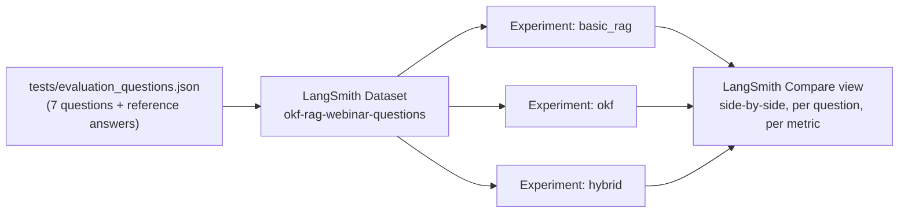

# 09. Evaluation Methodology

## 9.1 Why not just eyeball the answers?

Reading three answers side by side and going "yeah, that one looks better" doesn't scale, isn't
repeatable, and hides exactly the failure mode this project is about: Basic RAG's wrong answer to
the multi-hop question **reads as confident and fluent** (see doc 05). If we only judged "does
this sound like a good answer," Basic RAG would look fine. We need something that specifically
checks *is this actually supported by evidence and factually correct*, separately from *does it
read well*. That's what LLM-as-judge metrics are for.

## 9.2 The tool: `openevals`

[`openevals`](https://github.com/langchain-ai/openevals) is a small LangChain-maintained package
of ready-made "LLM-as-judge" evaluators. You give it a prompt template and a judge model; it
returns a function that scores an `(inputs, outputs, reference_outputs, context)` tuple. We use
four of its built-in RAG-specific prompts, with `continuous=True` so each score is a float between
0 and 1 (not just pass/fail) - that's what makes a metric-comparison *table* possible instead of
just a list of thumbs up/down.

```python
from openevals.llm import create_llm_as_judge
from openevals.prompts import RAG_HELPFULNESS_PROMPT

evaluator = create_llm_as_judge(
    prompt=RAG_HELPFULNESS_PROMPT,
    judge=judge_llm,        # our own Groq model, not OpenAI
    continuous=True,
)
score = evaluator(inputs=question, outputs=answer)["score"]
```

## 9.3 The four metrics, one at a time

### Helpfulness
**Question it answers:** "Does this response actually address what was asked?"
**Inputs it sees:** the question, the answer. *(No context, no reference - it judges relevance and
completeness of scope on their own.)*
**Why we picked it:** it's the metric that most resembles "does this look like a good answer" -
useful precisely *because* it's the one metric that can be fooled by fluent wrongness, which makes
the gap between it and `correctness` the whole point of this project.
**Example from our run:** Basic RAG's answer to the multi-hop path question scored
`helpfulness = 0.95` - genuinely well-written, clearly structured, directly on-topic - while its
`correctness` on the same answer was `0.15`. Helpfulness alone would have completely hidden the
failure.

### Groundedness
**Question it answers:** "Is every claim in this answer actually backed by the retrieved
evidence, or did the model add things that weren't there?"
**Inputs it sees:** the retrieved context, the answer. *(No question, no reference - purely
"does the answer stay within what the context supports.")*
**Why we picked it:** this is the metric that catches hallucination specifically, independent of
whether the *retrieval itself* was any good. A system can retrieve garbage and still score high
groundedness if it honestly says "I don't know" - which is exactly what happened with OKF on the
noise question (q7): it declined to answer, and scored `groundedness = 1.00` because declining is
trivially consistent with having no relevant context.
**Example from our run:** Hybrid RAG's groundedness dipped to `0.40-0.85` on several questions
even while `correctness` was `1.00` - because the judge checks every claim in the answer against
*both* halves of the fused context, and the raw-document half sometimes doesn't independently
confirm a fact that the OKF-path half does. It's still correct; it's slightly less than perfectly
grounded in *each individual piece* of evidence. That distinction is exactly what this metric is
for.

### Retrieval Relevance
**Question it answers:** "Is what got retrieved actually useful for answering this question, even
if the final answer used it well or badly?"
**Inputs it sees:** the question, the retrieved context. *(No answer at all - it only judges the
retrieval step, in isolation from generation.)*
**Why we picked it:** it separates "the retriever did its job" from "the generator wrote a good
answer" - two failure modes that would otherwise get blurred together into one score.
**Example from our run:** OKF's retrieval relevance on q7 (the noise question) scored `0.00` -
correctly - because the only concept it could match was "Python," which has nothing to do with
attendance policy. That's the retriever being *honestly* judged as unhelpful for this question,
exactly as it should be, since curriculum_rules.md was deliberately excluded from the OKF bundle
(see doc 06).

### Correctness
**Question it answers:** "Is this answer actually right, compared to a known-good reference
answer?"
**Inputs it sees:** the question, the answer, **and a reference answer** we wrote ahead of time
(see `reference_answer` in [`tests/evaluation_questions.json`](../tests/evaluation_questions.json)).
**Why we picked it:** it's the only one of the four metrics that checks against ground truth
rather than internal consistency - and it's the metric that most sharply exposes the multi-hop
failure, because a fluent, well-cited, *incomplete* chain is still factually wrong against the
reference "Python, Statistics, Machine Learning, Deep Learning, Computer Vision."
**Example from our run:** this is the headline number of the whole project - Basic RAG:
`0.15` on multi-hop questions; OKF and Hybrid: `1.00`. See doc 10.

## 9.4 Why a *separate* judge model, on a *separate* key

Two practical problems came up (documented in full in doc 08, section 8.2):

1. **Reliability.** `openai/gpt-oss-120b` (our generation model) occasionally failed to produce
   the forced structured-output tool call `openevals` needs, and Groq would reject the request
   outright. `openai/gpt-oss-20b` did this reliably in testing, so it became the dedicated judge
   model (`src/llm.py::get_judge_llm()`).
2. **Rate limits.** Running 3 pipelines x 7 questions x 4 metrics is 84 judge calls plus 21
   generation calls in one script - enough to hit Groq's free-tier tokens-per-minute (and, across
   multiple runs in one day, tokens-per-day) limits if judge and generation share a key. A second,
   optional `JUDGE_GROQ_API_KEY` keeps them separate.

Even with a dedicated model and key, judge calls are occasionally flaky (fast-inference providers
like Groq can be non-deterministic even at `temperature=0`). `_safe_score()` in
[`src/evaluation.py`](../src/evaluation.py) retries up to 4 times - with a 10-second backoff
specifically for rate-limit errors, 1.5 seconds for other transient errors - before giving up and
recording the score as missing (`None`, shown as `N/A`) rather than crashing the whole comparison
run over one flaky call.

## 9.5 Two ways to run the comparison

**Local** (`run_evaluation.py` -> `src/evaluation.py`): loops over the 7 questions in memory,
prints a live-updating table, writes `tests/eval_results.json`. Fast to iterate on, no external
account needed beyond the model providers.

**LangSmith** (`run_langsmith_eval.py` -> `src/langsmith_eval.py`): uploads the same 7 questions
as a LangSmith **Dataset** (`okf-rag-webinar-questions`), then runs each pipeline as its own
LangSmith **Experiment** against that dataset, with the same 4 `openevals` evaluators attached
(adapted from `openevals`' `(inputs, outputs, reference_outputs)` signature to LangSmith's
`(run, example)` evaluator signature - see `make_ls_evaluators()` in `src/langsmith_eval.py`).
The payoff: LangSmith's own "Compare" view lets you select all 3 experiments on that one dataset
and see every question, every metric, and every underlying trace (including the judge's own
reasoning) side by side in the dashboard - not just an aggregate table.


