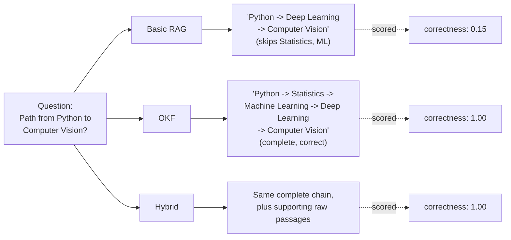

# 10. Results & Findings

Full raw data (every question, every answer's text, every score) is in
[`eval_results.md`](./eval_results.md) and [`../tests/eval_results.json`](../tests/eval_results.json).
This doc explains what the numbers mean. All scores are 0-1, from the 4 `openevals` metrics
explained in doc 09 (helpfulness, groundedness, retrieval_relevance, correctness), averaged across
questions, from one reference run.

## 10.1 Overall averages, across all 7 questions

| Metric | Basic RAG | OKF | Hybrid |
|---|---|---|---|
| Helpfulness | 0.78 | 0.79 | **0.94** |
| Groundedness | 0.86 | **1.00** | 0.76 |
| Retrieval relevance | 0.89 | 0.76 | **0.95** |
| Correctness | 0.75 | 0.82 | **0.99** |
| Latency (seconds) | 2.21 | **1.00** | 2.74 |

Nobody wins everything. OKF is by far the fastest (no embedding/rerank API calls, just an
in-memory graph walk) and the most grounded (it only ever states what's literally in a concept
file). Basic RAG is solid but unremarkable across the board. Hybrid wins helpfulness, retrieval
relevance, and correctness - the cost is a small groundedness dip (explained in doc 09.3) and the
highest latency, since it does the work of both other systems and then some.

## 10.2 The headline result: multi-hop questions

This is the comparison the whole project was built to produce. q2 ("path from Python to Computer
Vision") and q4 ("what to study before Computer Vision") both require chaining facts spread across
five documents (see doc 06).

| Metric | Basic RAG | OKF | Hybrid |
|---|---|---|---|
| Helpfulness | 0.95 | 0.90 | 0.90 |
| Groundedness | 0.55 | **1.00** | 0.55 |
| Retrieval relevance | 0.90 | **1.00** | 0.90 |
| **Correctness** | **0.15** | **1.00** | **1.00** |

Read the helpfulness and correctness rows together: Basic RAG's answer was rated *more* helpful-
sounding (0.95) than OKF's (0.90) while being drastically *less* correct (0.15 vs 1.00). That gap
is not noise - it's the exact failure mode described in doc 05: a fluent answer built from an
incomplete retrieval. The fix wasn't a better prompt or a better reranker; it was a different
retrieval mechanism that doesn't depend on textual similarity at all.

## 10.3 The noise-question check

q7 ("minimum attendance to sit final exams") tests something different: does each system stay
honest about what it actually knows? `curriculum_rules.md` is in the raw corpus but was
deliberately never added to the OKF bundle (doc 06.4).

| System | What it did | Correctness |
|---|---|---|
| Basic RAG | Found `curriculum_rules.md`, answered "75% attendance" correctly | 1.00 |
| Hybrid | Same, via its vector-retrieval half | 1.00 |
| OKF | Correctly said the information isn't covered by the concept graph | 0.00* |

*OKF's `0.00` here is *correct behavior scored low by a metric that expects an answer* - it
declined rather than fabricated, which is exactly what we wanted it to do, but `correctness`
against a reference answer necessarily scores "I don't know" as wrong when a real answer exists
elsewhere. This is worth calling out explicitly: **a low score is not automatically a bug.** Always
read what the system actually did (`tests/eval_results.json` has the full answer text), not just
the number.

## 10.4 What this does and doesn't prove

Following the teaching guidance this project is built around
([`01_OKF_RAG_Class_Concept_and_Plan.md`](../01_OKF_RAG_Class_Concept_and_Plan.md), section 24):

**Fair to claim**, backed by these numbers:
- On questions that require chaining facts across multiple documents, curated graph traversal
  (OKF) substantially outperformed plain vector search (Basic RAG) in this evaluation
  (correctness 1.00 vs 0.15).
- Combining both (Hybrid) matched OKF's correctness while adding detailed source citations and
  the highest helpfulness score of the three.
- Reranking did not close this gap, because the gap is a retrieval-*coverage* problem, not a
  retrieval-*ordering* problem (doc 05.3).

**Not fair to claim:**
- "OKF is better than RAG" - it wasn't, on direct-lookup and detailed-explanation questions,
  where Basic RAG's raw passages did real work Hybrid and OKF still benefited from.
- "This proves graph retrieval always wins on multi-hop questions" - it proves it on *this*
  dataset, at *this* scale (8 concepts), with facts distributed the way real course documentation
  actually tends to be. A differently-structured corpus, or one where the multi-hop chain happens
  to be restated in one document, would look different.
- "OKF replaces the need for curation" - every OKF concept file in this project was hand-written
  (the "Prerequisites" and "Related Concepts" links didn't extract themselves). That curation cost
  is real and is the actual trade being made: pay it once, get graph traversal for free afterward.

## 10.5 Where to look next

- Full per-question scores and complete answer text: [`eval_results.md`](./eval_results.md)
- The 3 LangSmith Experiments (same comparison, browsable trace-by-trace): see the links shared in
  this project's run history, dataset name `okf-rag-webinar-questions`
- Try it yourself: `streamlit run 1_basic_rag_app.py` / `2_okf_rag_app.py` / `3_hybrid_rag_app.py`
  and ask q2 or q4 directly - watch which chunks get retrieved in Basic RAG's UI versus which path
  gets traversed in OKF's UI.
